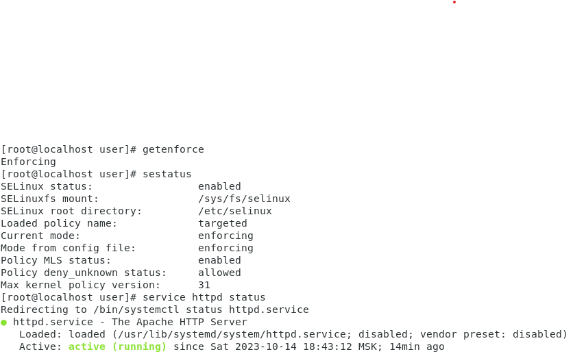
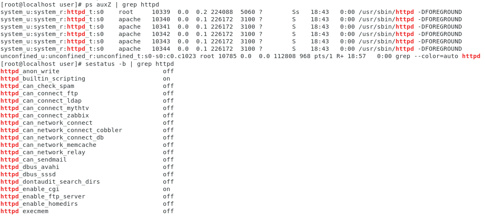
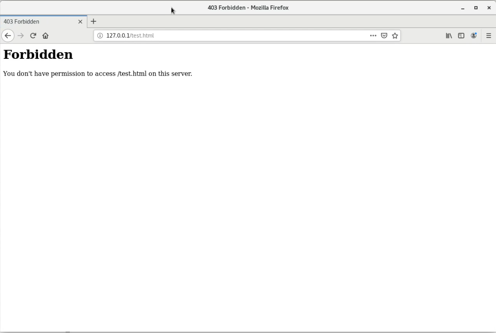
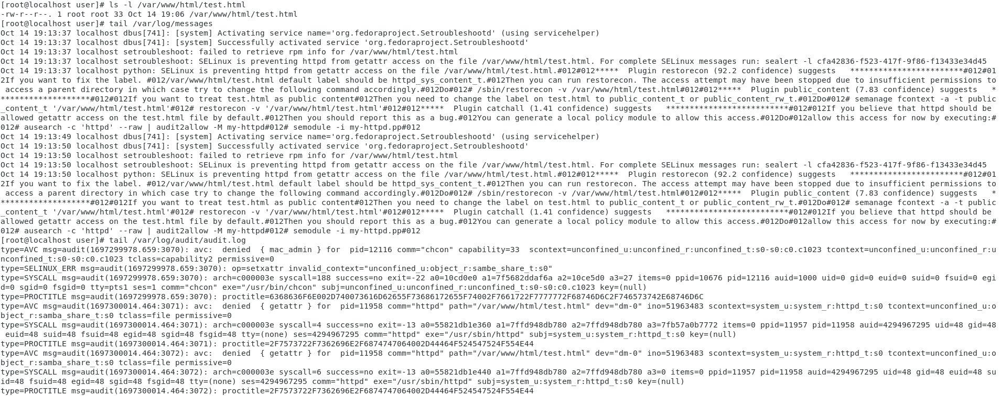
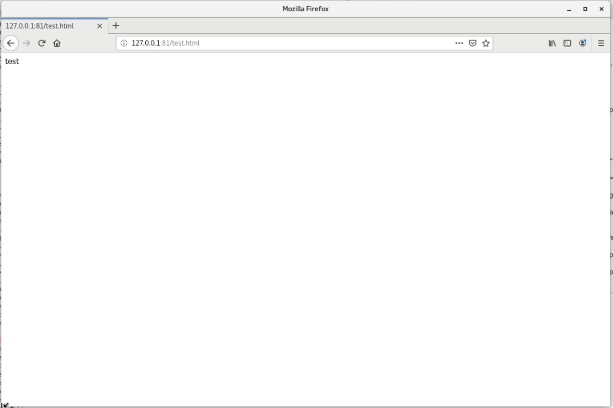

---
## Front matter
title: "Лабораторная работа № 6"
subtitle: "Дисциплина: Информационная безопасность"
author: "Покрас Илья Михайлович"

## Generic otions
lang: ru-RU
toc-title: "Содержание"

## Bibliography
bibliography: bib/cite.bib
csl: pandoc/csl/gost-r-7-0-5-2008-numeric.csl

## Pdf output format
toc: true # Table of contents
toc-depth: 2
lof: true # List of figures
lot: false
fontsize: 12pt
linestretch: 1.5
papersize: a4
documentclass: scrreprt
## I18n polyglossia
polyglossia-lang:
  name: russian
  options:
	- spelling=modern
	- babelshorthands=true
polyglossia-otherlangs:
  name: english
## I18n babel
babel-lang: russian
babel-otherlangs: english
## Fonts
mainfont: PT Serif
romanfont: PT Serif
sansfont: PT Sans
monofont: PT Mono
mainfontoptions: Ligatures=TeX
romanfontoptions: Ligatures=TeX
sansfontoptions: Ligatures=TeX,Scale=MatchLowercase
monofontoptions: Scale=MatchLowercase,Scale=0.9
## Biblatex
biblatex: true
biblio-style: "gost-numeric"
biblatexoptions:
  - parentracker=true
  - backend=biber
  - hyperref=auto
  - language=auto
  - autolang=other*
  - citestyle=gost-numeric
## Pandoc-crossref LaTeX customization
figureTitle: "Рис."
tableTitle: "Таблица"
listingTitle: "Листинг"
lofTitle: "Список иллюстраций"
lotTitle: "Список таблиц"
lolTitle: "Листинги"
## Misc options
indent: true
header-includes:
  - \usepackage{indentfirst}
  - \usepackage{float} # keep figures where there are in the text
  - \floatplacement{figure}{H} # keep figures where there are in the text
---

# Цель работы

Целью данной лабораторной работы является развитие навыков администрирования ОС Linux и получение первого практического знакомства с технологией SELinux

# Выполнение лабораторной работы

1. Я вошёл в систему с полученными учётными данными и убедился, что SELinux работает в режиме enforcing политики targeted. Далее я убедился, что веб-сервер работае(@fig:001).

{#fig:001}

2. Я нашёл веб-сервер Apache в списке процессов и посмотрел текущее состояние переключателей SELinux для Apache(@fig:002).

{#fig:002}

3. Я посмотрел статистику по политике с помощью команды seinfol: 4793 типа, 8 пользователей и 14 ролей(@fig:003).

{#fig:003}

4. Я определил тип файлов и поддиректорий, находящихся в директории /var/www. Далее я определил тип файлов в директории /var/www/html,  и круг пользователей, которым разрешено создание файлов(@fig:004).

{#fig:004}

5. Я создал от имени суперпользователя html-файл(@fig:005).

{#fig:005}

6. Я проверил контекст созданного мною файла(@fig:006).

{#fig:006}

7. Я обратился к файлу через веб-сервер, введя в браузере адрес
http://127.0.0.1/test.html.(@fig:007).

{#fig:007}

Файл был успешно отображён.

8. Я попробовал изучить справку man httpd_selinux, однако получил ошибку. Далее я изменил контекст файла test.html на  samba_share_t(@fig:008).

{#fig:008}

9. Я обратился к файлу через веб-сервер, введя в браузере адрес
http://127.0.0.1/test.html. Получил ошибку Forbidden(@fig:009).

{#fig:009}

10. Я изучил права доступа на файл test.html, просмотрел log-файлы и файл аудита(@fig:010).

{#fig:010}

Audit.log и log-файлы содержат в себе данные об отказе в доступе.

11. Я попробовал запустить веб-сервер Apache на прослушивание ТСР-порта 81(@fig:011).

{#fig:011}

И попробовал перезапустить веб-сервер(@fig:012).

{#fig:012}

Сервер перезапустился. Никаких сбоев не было, так 81 порт по умолчанию используется в пуле.

12. Я проанализировал лог-файлы(@fig:013).

{#fig:013}

Никаких новый записей не появилось.

13. Я выполнил команду привязки порта и получил ошибку, так как порт уже определен. Далее я проверил список портов(@fig:014).

{#fig:014}

14. Я попробовал перезапустить веб-сервер. Он успешно перезапустился, как и в предыдущий раз(@fig:015).

{#fig:015}

15. Я вернул контекст httpd_sys_cоntent__t к файлу test.html(@fig:016).

{#fig:016}

После этого я попробовал получить доступ к файлу через веб-сервер, введя в браузере адрес http://127.0.0.1:81/test.html (@fig:017).

{#fig:017}

Файл был успешно отображён.

16. Я исправил обратно конфигурационный файл apache, вернув Listen 80(@fig:018).

{#fig:018}

17. Я попробовал удалить привязку http_port_t к 81 порту, но поскольку данный порт определен политикой, я не смог исполнить эту команду. Далее я удалил файл test.html с помощью команды rm(@fig:019).

{#fig:019}

# Вывод

В ходе проделанной лабораторной работы я развил свои навыки администрирования ОС Linux и получил первое практическое знакомствое с технологией SELinux

# Список литературы{.unnumbered}

[1] https://esystem.rudn.ru/pluginfile.php/2090282/mod_resource/content/2/006-lab_selinux.pdf